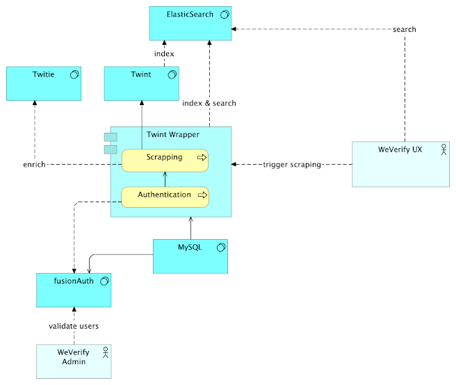

# Twint Wrapper

Twint Wrapper is a java Spring Boot application that expose operations in front of [Twint](https://github.com/twintproject/twint) scraping tool.

This tool supported following operations:

* collect  => ask for a twitter scraping with search criteria 
* status => check the scraping process
* collect-history => get request history
* collect-update => re-process an existing scraping

All operations are defined through swagger page **/twint-wrapper/swagger-ui.html**

Target build is a Docker image that combine Twint docker image and the java Spring-Boot application.

## Requirements
* ElasticSearch to index twitter scraping results
* MySQL to manage scraping sessions
* Docker
* Twint
* [FusionAuth](https://fusionauth.io/) to protect operations to authorized users

### Twint Docker build

Twint is the only scraper that is supported. It must be build as a docker image as a prerequisite to any new development.
Project pom.xml defined the build of twint bases on a commit 81f6c2c516a231136fbd821bd6a53d7959965fee of twint project.
Dockerfile that build twint image is located src/main/docker/twint

To build twint image with maven run:

	mvn docker:build -P twint-docker

Test twint image:

	docker run --rm -it twint:2.1.4 "twint -s '#pactemondialsurlesmigrations' --since '2018-12-01 00:00:00' --until '2018-12-15 00:00:00' -l fr --count"
 
## How to develop

 src/scripts/dev folder gives docker-compose file to start MySQL, ElasticSearch and FusionAuth.
 
	$cd src/scripts/dev
	$docker-compose up -d
 By default, the application will connect to the different containers 
 
 
 An other script add Kibana to monitor ElasticSearch Index.

	$ cd src/scripts/dev
	$ docker-compose -f docker-compose-kibana.yml up -d

## Builds
Default build build Spring-Boot application as jar file. Default profile is dev

	mvn clean package
	
Build docker image with Spring-Boot application and twint application

	mvn clean package -P prod
	
## Run service
Twitter-gateway can be run with different profiles (Default, dev & prod).

default:

	java -jar twint-wrapper.jar
	
dev:

	java -Dspring.profiles.active=dev -jar twint-wrapper.jar
	
prod

	java -Dspring.profiles.active=prod -jar twint-wrapper.jar

Full application with all components run with docker-compose

	$src/main/script/prod
	$docker-compose up -d
	

 
## FusionAuth configuration

FusionAuth executed with docker-compose use a setup sql script that embedded minimum configuration to add authorized users.
This inialisation will be set at first docker-compose startup.
Supported version is 1.15.* (tested with 1.15.2 & 1.15.5)

Setup to grant users are:

* Register user 
* Approved user through fusionAuth UI
* User ask a register code with his email address
* User ask a token with his received register code to use scraping operations. 

FusionAuth is accessible locally:
* [http://localhost:9011](http://localhost:9011)
* login: *weverify@weverify.eu*
* password: *Weverify$*

#### Email configuration with google account
FusionAuth send registration code by email.
To enable this feature, a SMTP server need to be setup in fusionAuth. 

Example with a Gmail Account:

 Tenants > Weverify (Edit) > Email (SMTP settings)

* Host: smtp.gmail.com
* Port: 587
* Username: <your google email address>
* Change password: <your google application generated password>  (password is stored encrypted locally)
* Security: TLS

To use your google account as a SMTP Gateway, you must [turn on 2-step Verification](https://support.google.com/accounts/answer/185839) in your account
* Account
* Security
* Turn on 2-step verification

Add an access to your local FusionAuth by creating [an application password](https://support.google.com/accounts/answer/185833?hl=en)

* Account
* Security
* Application password
* Other -> Give a Name -> Generated
* Copy paste the generated password to FusionAuth Email configuration. 
 

